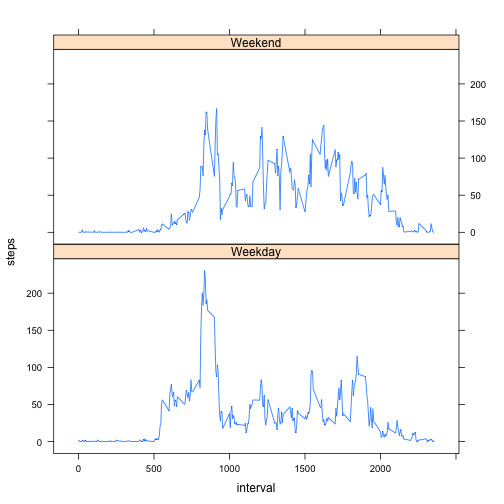

# Reproducible Research: Peer Assessment 1


## Loading and preprocessing the data

```r
act_table <- read.csv("./activity.csv", header = T)
```


## What is mean total number of steps taken per day?

```r
tmp_table <- aggregate(act_table$steps, by = list(Category = act_table$date), 
    FUN = sum)
colnames(tmp_table) <- c("date", "steps")
hist(tmp_table$steps, main = "Histogram of total daily steps", xlab = "Total daily steps")
```

 

```r
mean(as.vector(tmp_table[, 2]), na.rm = T)
```

```
## [1] 10766
```

```r
median(as.vector(tmp_table[, 2]), na.rm = T)
```

```
## [1] 10765
```


## What is the average daily activity pattern?

```r
tmp_table <- aggregate(act_table$steps, by = list(Category = act_table$interval), 
    FUN = mean, na.rm = T, na.action = NULL)
colnames(tmp_table) <- c("interval", "average steps")
plot(tmp_table, type = "l")
title("Average Daily Steps per Interval")
```

 


5-minute interval containing on average across all the days the maximum number of steps

```r
tmp_table[tmp_table$"average steps" == max(tmp_table$"average steps"), ]
```

```
##     interval average steps
## 104      835         206.2
```

## Imputing missing values

- Number of missing values is: 

```r
sum(is.na(act_table$steps))
```

```
## [1] 2304
```

 - Create a new table and replace the NAs in the new table with interval medians

```r
cp_table <- act_table
for (i in 1:nrow(tmp_table)) {
    cp_table[is.na(cp_table$step) & cp_table$interval == tmp_table[i, 1], 1] <- round(tmp_table[i, 
        2], 2)
}

tmp_table <- aggregate(cp_table$steps, by = list(Category = cp_table$date), 
    FUN = sum)
colnames(tmp_table) <- c("date", "steps")
hist(tmp_table$steps, main = "Histogram of total daily steps", xlab = "Total daily steps")
```

 

The mean and the median stay approximately the same

```r
mean(as.vector(tmp_table[, 2]))
```

```
## [1] 10766
```

```r
median(as.vector(tmp_table[, 2]))
```

```
## [1] 10766
```


## Are there differences in activity patterns between weekdays and weekends?

```r
library(lattice)
cp_table["Weekdays"] <- "Weekday"
cp_table[weekdays(as.Date(cp_table$date)) %in% c("Saturday", "Sunday"), 4] <- "Weekend"

tmp_table <- aggregate(cp_table$steps, by = list(interval = cp_table$interval, 
    Weekdays = cp_table$Weekdays), FUN = mean)
colnames(tmp_table) <- c(colnames(tmp_table)[1:2], "steps")
agg_table <- transform(tmp_table, Weekdays = factor(Weekdays))
xyplot(steps ~ interval | Weekdays, data = agg_table, layout = c(1, 2), type = "l")
```

 

```r

```


